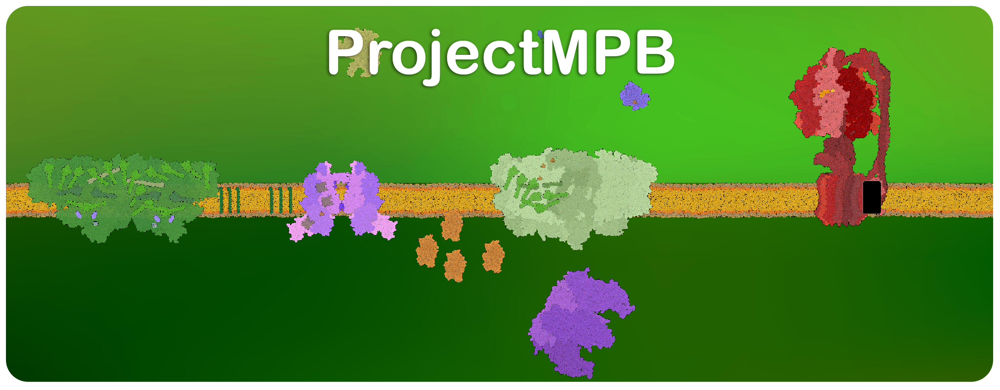
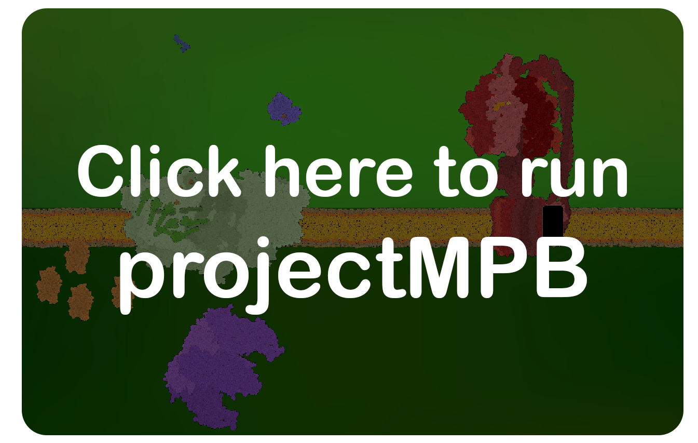
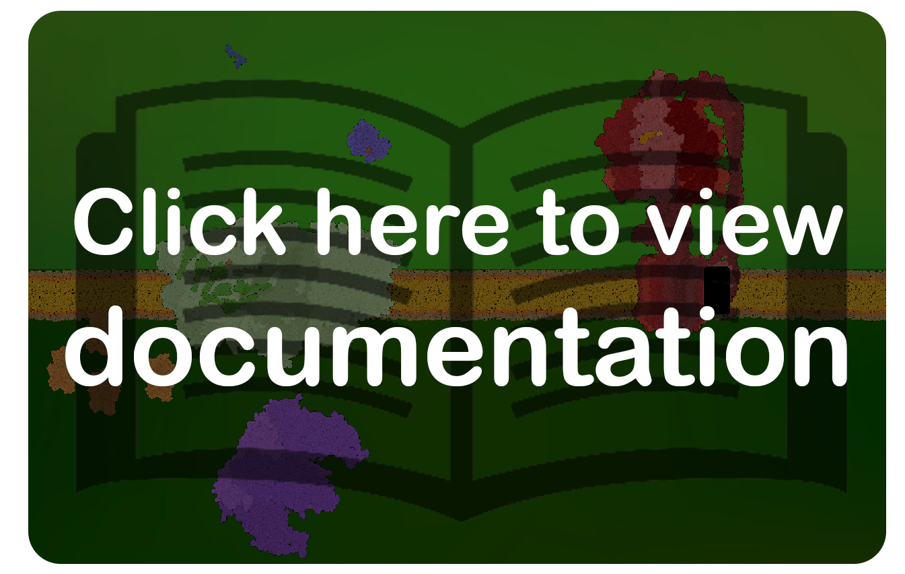
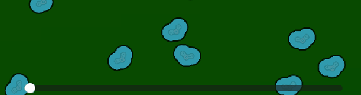
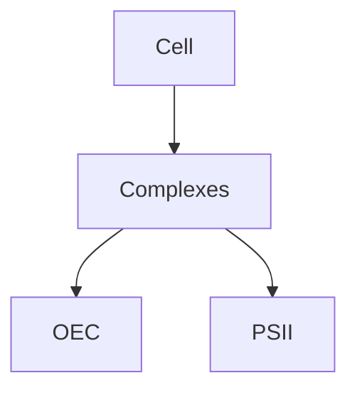

<div align="center">
<!--  <div style="display:inline-block; text-align:left; max-width:900px; font-size:20px;">  -->
  <div style="display:inline-block; max-width:900px; font-size:20px;">
    ProjectMPB is an interactive simulation of photosynthesis developed at the University of Turku.<br>
    The goal is to provide a scientifically sound and visually rich tool for researchers and educators to observe photosynthetic processes in silico.
  </div>
</div>

<br>

<div align="center">
  <div style="display:inline-block;">
    <a href="https://example.com/docs" target="_blank" rel="noopener noreferrer" style="display:inline-block;">
      
    </a>
    <a href="https://example.com/docs" target="_blank" rel="noopener noreferrer" style="display:inline-block;">
      
    </a>
  </div>
</div>

<br>
<br>

<div align="center">
<!--  <div style="display:inline-block; text-align:left; max-width:900px; font-size:20px;">  -->
  <div style="display:inline-block; max-width:900px; font-size:45px;">
    Quick tutorial
  </div>
</div>

<br>

<div align="center">
  <div style="display:inline-flex; gap:20px; align-items:center;">
      
      
      
</div>
<div align="center">
  <div style="display:inline-flex; gap:20px; align-items:center;">
      
</div>


<br><br><br><br><br><br><br><br><br><br><br><br><br><br><br><br><br><br><br><br><br><br><br><br><br><br><br><br><br><br><br><br><br><br><br><br><br><br><br><br><br><br><br><br><br><br><br><br><br><br><br><br><br><br><br><br><br><br><br><br><br><br><br><br><br><br><br><br><br><br><br><br><br><br><br><br><br><br><br><br>
## Maybe some table of content?
- [Overview](#overview)
- [Installation](installation.md)
- [Usage](usage.md)
- [Biology](biology/proteins.md)
  - [Protein Complexes](biology/complexes.md)
  - [Photosystems](biology/photosystems/PSI.md)

test

## Proteins and protein complexes.
- <span style="color:#32CD32">🌿 Oxygen-evolving complex.</span>
  - Important short description of OEC.
  - [Read more details](Documentation/OEC.md).
  - Go to chapter directly: [function](Documentation/OEC.md#function).
  - Code sniplet [L301](scenes/Level_7_scenes_and_scripts/Photosystem_II.gd#L301).
  - Code sniplet [L301–L601](scenes/Level_7_scenes_and_scripts/Photosystem_II.gd#L301-L601).
- <span style="color:#32CD32">🌿 Photosystem II.</span>
  - Whatever.

## Some ideas to make MD look nice.
### Example GDScript.

```gdscript
func test():
    print("Protein Complexes!")
```

```py
func test():
    print("Protein Complexes!")
```


<details>
  <summary>
    ✅ GDScript dropdown test.🔎
  </summary>

  <pre><code style="color: orange;">
def water_binding():
    print("OEC binds two water molecules!")
  </code></pre>
</details>


<details>
  <summary>
    ✅ GDScript dropdown test.🔎
  </summary>
  <gdlink>"Project/Scripts/OEC.gd"</gdlink>
```py
def water_binding():
    print("OEC binds two water molecules!")
```
</details>


### Example MD image placement.


### 📊 Some diagrams.
- Diagrams with **Mermaid** (supported on GitHub!)  

Example:



---
### Extra ideas:
- Glossary.md to keep links to each and every one element of cell biology.
---
